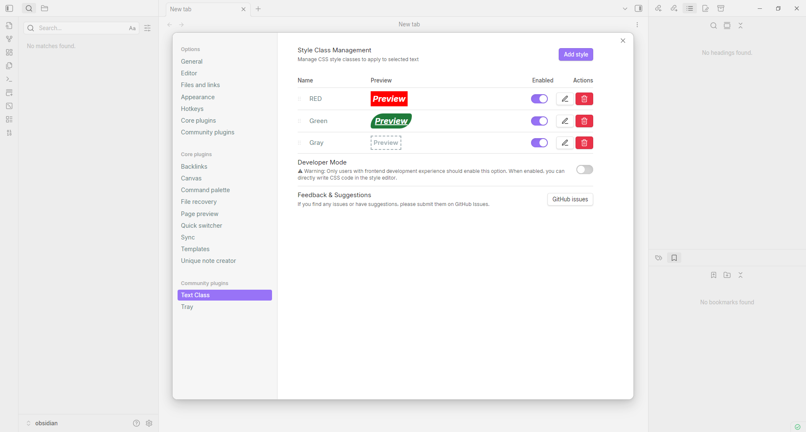
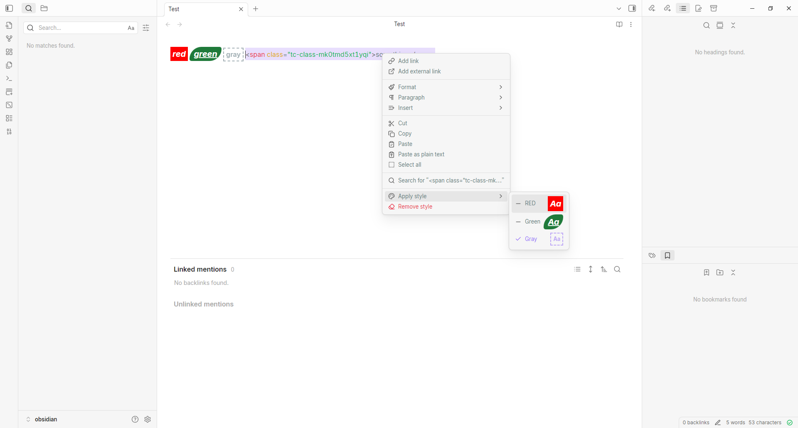

# Text Class

Apply custom CSS classes to selected text in Obsidian.

**GitHub**: https://github.com/elling19/obsidian-text-class

[中文](#中文说明) | [English](#english)

---

## English

### Features

- **Custom CSS Classes**: Define your own CSS classes with custom styles in the settings
- **Right-Click Menu**: Apply styles to selected text via context menu

### Installation

1. Open Obsidian Settings
2. Go to **Community plugins** and disable **Safe mode**
3. Click **Browse** and search for "Text Class"
4. Install the plugin and enable it

### Manual Installation

1. Download `main.js`, `styles.css`, and `manifest.json` from the latest release
2. Create a folder `text-class` in your vault's `.obsidian/plugins/` directory
3. Copy the downloaded files into this folder
4. Reload Obsidian and enable the plugin in Settings → Community plugins

### Usage

1. **Configure Styles**: Go to **Settings → Text Class** to add, edit, or remove CSS classes
2. **Apply Styles**: 
   - Select text in the editor
   - Right-click to open the context menu
   - Choose **Apply Text Style** and select a style
3. **Remove Styles**: Right-click on styled text and select **Remove Text Style**

### Example Styles

| Name | CSS Style |
|------|-----------|
| Highlight | `background-color: yellow;` |
| Important | `color: red; font-weight: bold;` |
| Code | `font-family: monospace; background: #f0f0f0; padding: 2px 4px;` |

### Feedback

If you have any issues or suggestions, please submit them at:
**GitHub Issues**: https://github.com/elling19/obsidian-text-class/issues

---

## 中文说明

### 功能特点

- **自定义 CSS 类**：在设置中定义自己的 CSS 类和样式
- **右键菜单**：通过右键菜单为选中文本应用样式

### 安装方法

1. 打开 Obsidian 设置
2. 进入 **第三方插件**，关闭 **安全模式**
3. 点击 **浏览** 并搜索 "Text Class"
4. 安装并启用插件

### 手动安装

1. 从最新发布版本下载 `main.js`、`styles.css` 和 `manifest.json`
2. 在你的仓库 `.obsidian/plugins/` 目录下创建 `text-class` 文件夹
3. 将下载的文件复制到该文件夹
4. 重新加载 Obsidian，在设置 → 第三方插件中启用

### 使用方法

1. **配置样式**：进入 **设置 → Text Class** 添加、编辑或删除 CSS 类
2. **应用样式**：
   - 在编辑器中选中文本
   - 右键打开上下文菜单
   - 选择 **应用文本样式** 并选择一个样式
3. **移除样式**：右键点击已应用样式的文本，选择 **移除文本样式**

### 样式示例

| 名称 | CSS 样式 |
|------|----------|
| 高亮 | `background-color: yellow;` |
| 重要 | `color: red; font-weight: bold;` |
| 代码 | `font-family: monospace; background: #f0f0f0; padding: 2px 4px;` |

### 反馈与建议

如果您发现问题或有任何建议，请在以下地址提交：
**GitHub Issues**: https://github.com/elling19/obsidian-text-class/issues

---

## License

MIT License
